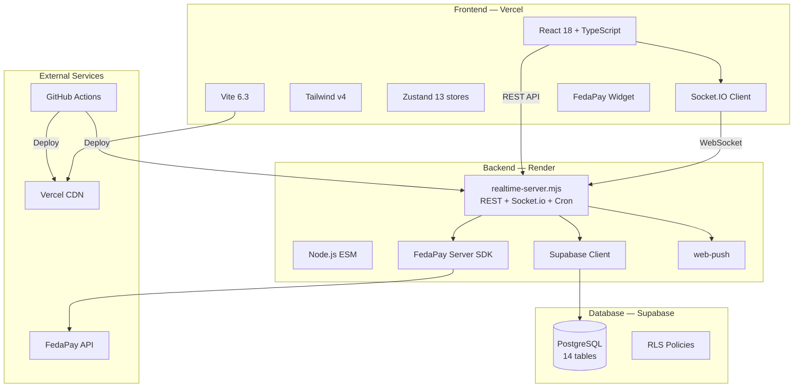
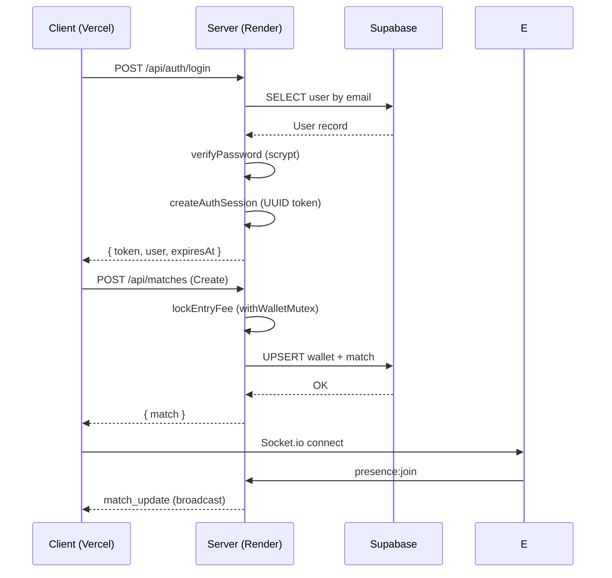

# Architecture ZOYD

## Stack



## Data Flow



## Security Layers

| Layer | Implementation |
|-------|---------------|
| Authentication | UUID token + HttpOnly cookie |
| Authorization | Role-based (player/admin) |
| Rate Limiting | 21 guards across auth/wallet/social/admin/chat |
| Input Validation | Zod (client) + engine validation (server) |
| XSS Prevention | HTML entity escaping (sanitizeText) |
| CSRF | SameSite=Strict cookies |
| Wallet Safety | Mutex per userId + rollback on failure |
| Error Handling | ErrorBoundary + structured logging |

## File Structure

```
Multiplayer Gaming Platform/
├── server/
│   ├── realtime-server.mjs    # Monolith: REST + Socket.io + cron
│   ├── persistence.mjs        # Supabase CRUD
│   ├── wallet-engine.mjs      # Wallet logic + mutex
│   ├── match-engine.mjs       # Match lifecycle
│   ├── tournament-engine.mjs  # Tournament logic
│   ├── league-engine.mjs      # League seasons
│   ├── metrics.mjs            # Prometheus metrics
│   └── *.test.mjs             # 162 Vitest tests
├── src/
│   ├── app/
│   │   ├── components/        # UI components
│   │   ├── hooks/             # Auth, chat, wallet, SW bootstraps
│   │   ├── layouts/           # Root, Dashboard, Admin, Auth
│   │   ├── lib/               # API clients (apiClient, authApi, etc.)
│   │   ├── pages/             # 16 pages + sub-pages
│   │   ├── stores/            # 13 Zustand stores
│   │   └── routes.tsx         # Lazy-loaded routes
│   ├── features/              # Match, Tournament, League
│   └── lib/                   # Utils, competition, walletFunding
├── e2e/                       # Playwright E2E tests
└── docs/                      # OpenAPI, architecture, deployment
```
